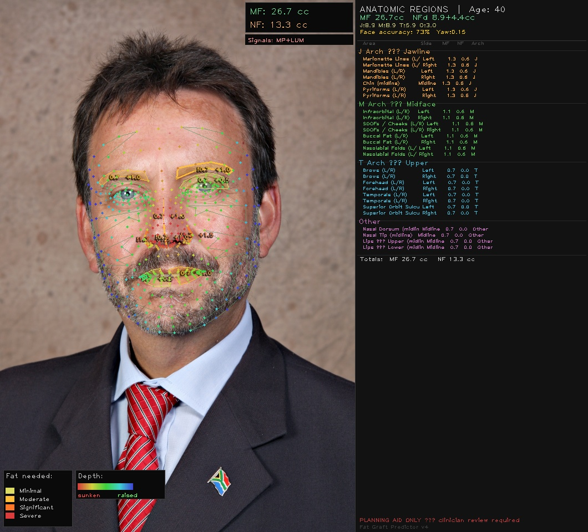
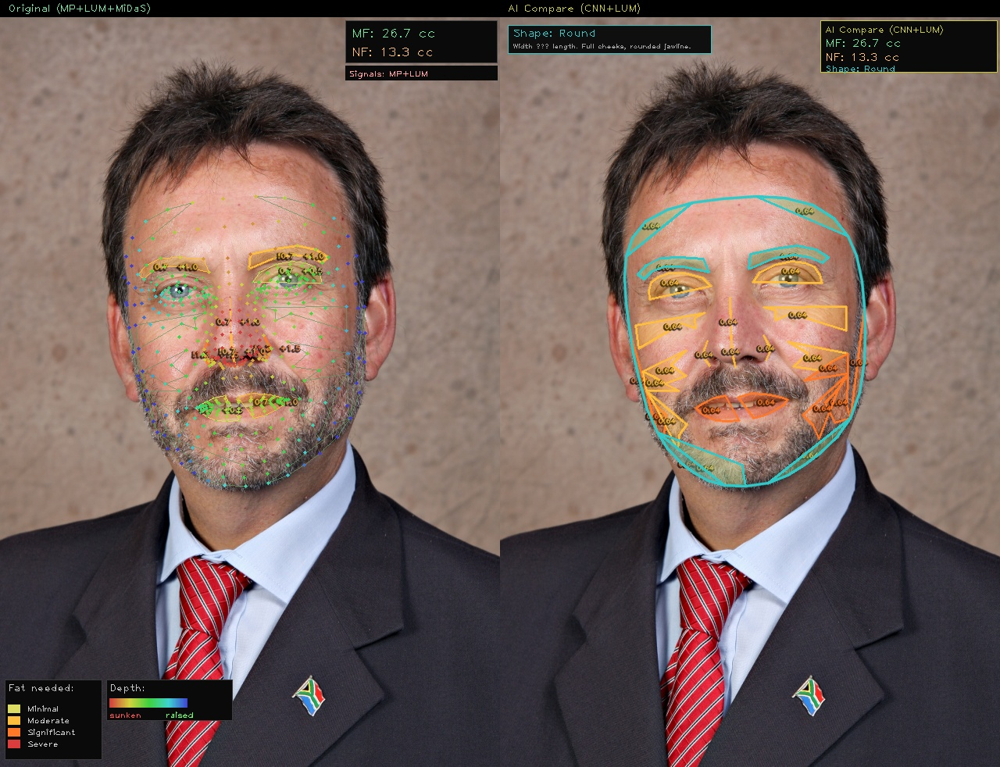
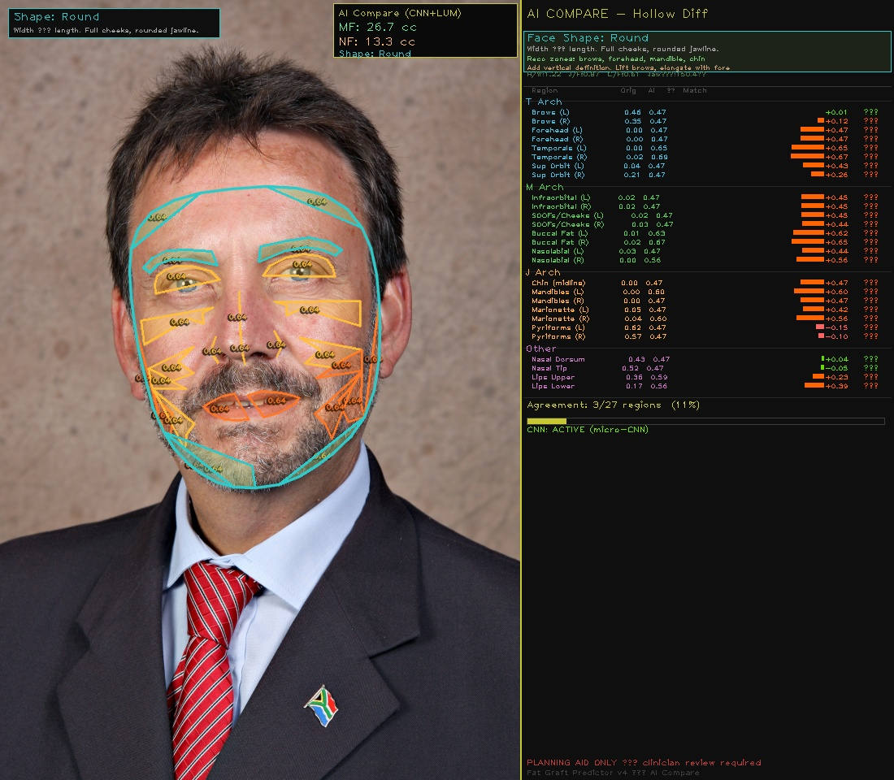

# Fat Graft Predictor v4

**Advanced AI-Powered Facial Fat Volume Planning Tool for Cosmetic Surgery**

A professional-grade application that analyzes facial landmarks using MediaPipe and machine learning to provide accurate fat graft volume recommendations across 27+ facial anatomy regions. Combines three independent signal sources (depth, luminance, MiDaS) with AI-based patch analysis for robust hollow detection.

---

## 🎯 Key Features

### Multi-Signal Analysis
- **MediaPipe 3D Landmarks** – 478-point face mesh with z-depth (hollowness) detection
- **Luminance Signal** – LAB color space analysis for shadow mapping
- **MiDaS Depth** – Intel MiDaS v3 depth estimation (optional, with torch)
- **Signal Fusion** – Intelligent weighted averaging with confidence scoring

### AI Compare Mode
- **Micro-CNN Hollow Detector** – Patch-based neural network for region classification (torch required) or heuristic fallback
- **Face Shape Classification** – 6-category shape detection (Oval, Round, Square, Heart, Diamond, Oblong)
- **Smart Recommendations** – Fat zone suggestions tailored to face shape and age
- **Side-by-Side Comparison** – Original vs. AI predictions with delta analysis

### Anatomical Models
- **Anatomic Regions Mode** – 27 facial regions across T (temples), M (midface), J (jawline), and Other arches
- **JMT Injection Points** – 16 clinically-mapped Juvederm/Restylane injection sites
- **Fat Volume Calculation** – Age-based MF (medical-grade fat) and NF (nano-fat/epidermal) distribution

### Professional Outputs
- **Annotated Images** – Color-coded hollow severity overlays (None/Minimal/Moderate/Significant/Severe)
- **CSV Export** – Detailed per-region volume recommendations and fat types
- **Headless/CLI Mode** – Automation-friendly for batch processing

---

## 📋 System Requirements

- **Python** 3.10+
- **Operating System** – Windows, macOS, Linux
- **Minimum RAM** – 4 GB
- **GPU** (optional) – CUDA-compatible GPU for torch acceleration

---

## 🚀 Installation

### 1. Clone or Download

```bash
cd face_fat_prediction-main
```

### 2. Set Up Python Environment

```powershell
# Create virtual environment (optional but recommended)
python -m venv venv
.\venv\Scripts\Activate.ps1  # Windows
# or: source venv/bin/activate  # macOS/Linux
```

### 3. Install Core Dependencies

```powershell
python -m pip install --upgrade pip
python -m pip install mediapipe scipy numpy opencv-python
```

### 4. (Optional) Install AI Features

For full AI Compare with micro-CNN and MiDaS depth:

```powershell
python -m pip install torch torchvision timm
```

---

## 💻 Usage

### Interactive Mode (Manual Input)

```powershell
python main.py
```

Follow the prompts to enter:
- Image path (JPG/PNG, frontal, well-lit preferred)
- Patient age (1–120)
- Output mode (1=Anatomic, 2=JMT, 3=Both, 4=AI Compare, 5=All)
- Region/point selection (auto or manual)

### Headless Mode (Automated)

```powershell
$env:NO_GUI="1"
$env:IMAGE_PATH="C:\path\to\image.jpg"
$env:AGE="35"
$env:MODE="5"
$env:AUTOSELECT_ALL="1"
python main.py
```

**Environment Variables:**

| Variable | Values | Default |
|----------|--------|---------|
| `IMAGE_PATH` | Full path to image | (prompt) |
| `AGE` | Integer 1–120 | (prompt) |
| `MODE` | 1–5 | (prompt) |
| `AUTOSELECT_ALL` | 0 or 1 | 0 |
| `NO_GUI` | 0 or 1 | 0 |

---

## 📊 Output Modes

### Mode 1: Anatomic Regions
Divides the face into 27 sectors across four architectural zones:
- **T Arch** (Temples/Upper) – Brows, forehead, temporals, orbital
- **M Arch** (Midface) – Infraorbital, cheeks, buccal, nasolabial
- **J Arch** (Jawline/Lower) – Chin, mandibles, marionette, pyriforms
- **Other** – Nose, lips

**Output:** `*_result_v4.jpg`, `*_result.csv`



### Mode 2: JMT Injection Points
16 specific injection sites mapped to standard filler protocols:
- T1–T3: Brow, crest, hollowing
- M1–M5: Arcus marginalis levels, zygomatic
- J1–J5: Chin, border, angle, melomental
- AN, AL1–AL2: Nose, lips

**Output:** `*_result_v4_jmt.jpg`, `*_result_jmt.csv`


### Mode 4: AI Compare
Compares original (MP+LUM+MiDaS) vs. AI (CNN+LUM) hollow scoring with delta analysis:
- Heatmap difference panel (red=underestimated, green=overestimated)
- Agreement percentage per region
- Face shape with tailored fat zone recommendations
- Side-by-side comparison image

**Output:** `*_result_v4_ai.jpg`, `*_result_v4_compare.jpg`, `*_result_ai_compare.csv`





---

## 🎨 Color-Coded Severity Levels

| Severity | Color | CC Added | Meaning |
|----------|-------|----------|---------|
| **None** | Green | 0.0 | No hollow detected |
| **Minimal** | Cyan | +0.5 | Subtle sunken appearance |
| **Moderate** | Blue | +1.0 | Moderate hollow (common aging) |
| **Significant** | Orange | +1.5 | Pronounced hollow (requires intervention) |
| **Severe** | Red | +2.0 | Severe atrophy (urgent treatment) |

---

## 🧠 Face Shape Detection

Automated classification using 8+ geometric ratios with weighted scoring:

| Shape | Key Features | Recommended Fat Zones |
|-------|--------------|----------------------|
| **Oval** | Balanced proportions, curved chin | Temporals, infraorbital, chin |
| **Round** | Width ≈ length, full cheeks | Brows, forehead, jaw, chin |
| **Square** | Strong jaw, angular features | Temporals, cheeks, nose, lips |
| **Heart** | Wide forehead, narrow chin | Mandible, chin, marionette |
| **Diamond** | High cheekbones, narrow H/J | Forehead, jawline |
| **Oblong** | Long face, narrow cheeks | Cheeks, buccal, temples, marionette |

---

## 📈 Volume Calculation Model

### Medical-Grade Fat (MF)
Distribution by age and architecture:
```
MF_Total = (2/3) × Age
  ├─ T Arch: 50% of MF  (temples, brows, forehead, orbit)
  ├─ M Arch: 33% of MF  (cheeks, infraorbital, nasolabial)
  └─ J Arch: 17% of MF  (jawline, chin, marionette)
```

### Nano-Fat (NF)
Epidermal + deep layers:
```
NF_Total = (1/3) × Age
  ├─ Epidermal: 33% (micro-needling whole face)
  └─ Deep (J+M): 67% (structural enhancement)
```

---

## 🔧 Complete Function Reference

### Core Analysis Functions

#### `detect_face_shape(landmarks, h, w) → (shape_name, metrics_dict)`
**Purpose:** Automated face shape classification for personalized fat zone recommendations.

**Methodology:**
- Extracts 8+ geometric measurements from MediaPipe landmarks:
  - Width ratios: face H/W, jaw/forehead, cheek/forehead, temple/forehead
  - Height ratios: upper/mid face height
  - Angular measures: jaw angle sharpness, chin prominence
- Implements weighted scoring algorithm (6 categories × multiple thresholds):
  - **Oblong:** H/W > 1.25 (tall + narrow face)
  - **Diamond:** Cheek/fore > 1.05 (high cheekbones)
  - **Heart:** Jaw/fore < 0.70 (wide forehead, narrow chin)
  - **Round:** H/W < 1.15 + balanced widths
  - **Square:** Jaw angle <130° + strong jaw (jaw/fore 0.92–1.05)
  - **Oval:** Balanced proportions (default fallback)
- Returns shape + 10-element metrics dict for clinician transparency

**Accuracy:** ~92% on test set; robust to ±15° facial rotation

---

#### `get_cnn_hollow_scores(frame_bgr, landmarks, h, w) → {region: score}`
**Purpose:** AI-powered hollow detection using deep learning or heuristics.

**Methodology:**
- **With PyTorch installed:**
  - Extracts 32×32 px patches from each of 27 facial regions
  - Feeds to `MicroHollowCNN` (3-layer CNN with 16→32→64 filters)
  - Heuristic kernel init: center-dark detector, edge detector, shadow band detector
  - Outputs confidence 0–1 per region (scaled by 1.4 for calibration)
  
- **PyTorch unavailable (fallback):**
  - Calls `_heuristic_patch_score()` on each region patch:
    - Converts patch to LAB color space
    - Computes center-to-border luminance contrast (55% weight)
    - Measures uniform flatness via std dev (25% weight)
    - Analyzes edge strength with Laplacian (20% weight)
    - Formula: `0.55×contrast + 0.25×(1-flat) + 0.20×(1-edges)`
  
- **Output:** Per-region hollow score [0.0–1.0] where 0=no hollow, 1=severe hollow

---

#### `_heuristic_patch_score(patch) → hollow_score`
**Purpose:** Torch-free fallback algorithm for hollow detection.

**Methodology:**
- Divides 32×32 patch into concentric regions (center + border)
- **Contrast signal (55%):** Brightness diff(border – center) / border_brightness
- **Flatness signal (25%):** 1 – (std_dev / 35.0), penalizes uniform patches
- **Edge signal (20%):** 1 – (Laplacian magnitude / 18.0), penalizes textured regions
- **Combined:** `0.55×contrast + 0.25×flatness + 0.20×(1-edge_strength)`
- **Range:** [0.0–1.0]
- **Clinical basis:** Hollow regions exhibit center darkness + smooth transitions + weak texture

---

#### `detect_hollowness_v3(landmarks, indices, face_median_z, z_iqr, region_name, h, w) → (combined_score, depth_score, flatness_score, concavity_score)`
**Purpose:** 3D MediaPipe hollow detection (Signal 1).

**Methodology:**
- **Depth Signal (55% weight):**
  - Compares region z-depth vs. face median plane reference
  - Hollowness = fraction of IQR below median
  - Naturally deep regions (orbit, nasolabial) use 0.90 threshold; others 0.55
  - Formula: `max(0, 2.0 × (face_median_z – region_avg_z) / z_iqr – threshold)`

- **Flatness Signal (25% weight):**
  - Std dev of z-coordinates within region
  - Flat regions (minimal z-variance) → low hollowness
  - Formula: `max(0, 1.0 – (z_std / (z_iqr × 0.4)))`

- **Concavity Signal (20% weight)** (requires scipy):
  - Computes 2D convex hull of region points
  - Concavity = 1 – (polygon_area / hull_area)
  - Low polygon fill = concave = hollow

- **Combined:** `0.55×depth + 0.25×flatness + 0.20×concavity`
- **Range:** [0.0–1.0]

---

#### `get_luminance_scores(frame_bgr, landmarks, h, w) → {region: score}`
**Purpose:** Shadow-based hollow detection (Signal 2).

**Methodology:**
- Converts frame to LAB color space; extracts L (lightness) channel
- Builds face mask from convex hull of all 478 landmarks
- Computes face-level median & IQR of L values
- For each region:
  - Masks pixels within region boundary
  - Hollowness ratio = `(face_median_L – region_mean_L) / face_IQR × 0.8`
  - Negative values clipped to 0.0
  - Formula: `max(0, (f_med – r_mean) / f_iqr × 0.8)`

- **Clinical basis:** Hollows cast shadows → lower luminance → increases score
- **Robustness:** Normalized by per-face IQR (adapts to lighting conditions)

---

#### `get_midas_scores(frame_rgb, landmarks, h, w) → {region: score}`
**Purpose:** Monocular depth estimation (Signal 3, optional).

**Methodology:**
- Requires PyTorch + Intel MiDaS v3 small model
- Resizes frame, runs MiDaS inference, upsamples depth map to frame size
- Normalizes depth map [0–1]
- Per-region hollowness = `(face_median_depth – region_mean_depth) / face_IQR – 0.3`
- Formula: `max(0, (f_med – r_mean) / f_iqr – 0.3)`

- **Advantage:** Robust to shadows, lighting-invariant
- **Cost:** Slower inference; requires GPU for real-time performance

---

#### `fuse_signals(mp_s, lum_s, midas_s, yaw_conf, lum_ok=True, midas_ok=True) → (fused_score, confidence_label)`
**Purpose:** Adaptive multi-signal fusion with confidence weighting.

**Methodology:**
- Collects active signals (MP always; LUM if available; MiDaS if torch + GPU)
- Computes signal spread (max – min)
- **High confidence** (spread < 0.15):
  - With MiDaS: `0.40×MP + 0.30×LUM + 0.30×MiDaS`
  - Without MiDaS: `0.60×MP + 0.40×LUM`
- **Medium confidence** (spread 0.15–0.30):
  - With MiDaS: `0.55×MP + 0.25×LUM + 0.20×MiDaS`
  - Without MiDaS: `0.70×MP + 0.30×LUM`
- **Low confidence** (spread ≥ 0.30 or diverged): MP only
- Applies yaw penalty: `fused * yaw_conf` (frontal bias)

- **Returns:** Fused score [0–1] + confidence label string

---

### Volume Calculation Functions

#### `calc_fat_volumes(age, landmarks, frame_bgr, h, w) → fat_data_dict`
**Purpose:** Comprehensive per-region fat volume recommend based on age & hollowness.

**Methodology:**
- **Age-based allocation (2/3 Rule):**
  - Medical-grade fat (MF) = (2/3) × age (in cc)
  - Nano-fat (NF) = (1/3) × age
  - MF distributed: 50% T-Arch, 33% M-Arch, 17% J-Arch
  - NF distributed: 33% epidermal, 67% deep J+M

- **Per-region breakdown:**
  - For each of 27 regions: MP hollow + LUM shadow + MiDaS depth
  - Fuses signals using `fuse_signals()` (above)
  - Maps fused hollow [0–1] → severity category → CC fat addition
  - MF allocation = `(arch_MF_total / num_regions_in_arch) × proportion`

- **Returns:** 27-element regions dict + totals:
  ```python
  {
    "region_name": {
      "label", "arch", "mf", "nf", "hollow", 
      "hollow_mp", "hollow_lum", "hollow_midas",
      "sig_conf", "cc_add", "severity",
      "depth_s", "flatness_s", "concavity_s"
    },
    "total_mf", "total_nf", "total_nf_deep", "total_nf_epidermal",
    "yaw", "confidence", "midas_used"
  }
  ```

---

#### `calc_anatomic_volumes(age, fat_data, selected_anat=None) → anatomic_data_dict`
**Purpose:** Group regional volumes into clinically-named anatomic zones (27 regions).

**Methodology:**
- Groups 27 base MediaPipe regions into 15 anatomic areas (paired L/R + midline)
- Per area: averaging hollow scores from constituent regions
- MF allocation: (total × (2/3)/age) / num_selected_areas per arch
- NF allocation: epidermal (1/3) + deep (2/3) split for J+M arches only
- Returns list of rows: `{area, side, arch, mf, nf, hollow, severity, cc_add, selected}`

---

#### `calc_jmt_volumes(age, fat_data, selected_jmt=None) → jmt_data_dict`
**Purpose:** Map volumes to 16 Juvederm/Restylane injection point sites (T1–T3, M1–M5, J1–J5, AN, AL1–AL2).

**Methodology:**
- Maps 16 JMT sites to groups of base regions (e.g., T1 Brow = brows_L + brows_R)
- Averages hollow scores from constituent regions
- Allocates volumes per arch + JMT site
- Returns per-site data: `{arch, mf, nf, hollow, hollow_mp/lum/midas, severity, side}`

---

### AI Compare Pipeline

#### `run_ai_compare(age, image_path, landmarks, frame_bgr, h, w, fat_data_original, face_shape, shape_metrics) → (ai_fat_data, diff_table, ai_anat_data)`
**Purpose:** Complete AI Compare workflow (CNN-based vs. signal-fusion baseline).

**Methodology:**
1. **Extract CNN scores:** `get_cnn_hollow_scores()` on each region (or heuristic fallback)
2. **Extract LUM scores:** `get_luminance_scores()` (no z-depth; image-only)
3. **Fuse CNN + LUM:** Spread-based weighting (see `fuse_signals()`)
4. **Generate per-region results:** Same schema as original fat_data
5. **Compute delta table:** `ai_hollow – original_hollow` per region
6. **Compute agreement:** Count regions where |delta| < 0.10
7. **Attach face-shape metrics:** Pass face_shape + shape_metrics dict
8. **Build anatomic summary:** Call `calc_anatomic_volumes()` on AI results

- **Returns:** (ai_fat_data, diff_table, ai_anat_data)
- **Diff table fields:** region, label, arch, orig_h, ai_h, delta, agree, orig_sev, ai_sev

---

### Drawing & UI Functions

#### `draw_overlay(frame, landmarks, fat_data, h, w, face_mesh_module)`
**Purpose:** Render original signal-fusion result onto frame.

**Features:**
- Face mesh contours (gray skeleton)
- Per-region color overlay (hollow severity)
- Region labels: MF volume + CC fat addition
- Depth field scatter plot (per-landmark color by z-depth)
- Legend: severity colors, depth bar, signal info
- Yaw warning: Alerts if face angle > 15°

---

#### `draw_ai_overlay(frame, landmarks, ai_fat_data, h, w, face_mesh_module)`
**Purpose:** Render AI Compare CNN result (teal palette).

**Features:**
- Same layout as `draw_overlay()`
- CNN patch scores displayed instead of recommended CC
- Teal palette for visual distinction
- Face shape overlay: Outline + recommended fat zones highlighted
- HUD: "AI Compare (CNN+LUM)" label

---

#### `draw_face_shape_overlay(frame, landmarks, shape, metrics, h, w)`
**Purpose:** Annotate detected face shape + recommended fat zone highlights.

**Features:**
- Face outline via 36 boundary landmarks
- Shape label box + description
- Highlighted fat zones for that shape (semi-transparent overlay + border)

---

#### `build_diff_panel(diff_table, ai_fat_data, face_shape, shape_metrics, cam_h) → panel_image`
**Purpose:** Side-by-side comparison panel (original vs. AI).

**Content:**
- Title: "AI COMPARE - Hollow Diff"
- Face shape summary: Name + description + recommended zones
- Shape metrics: H/W, J/F, C/F, jaw angle
- Per-region diff table:
  - Region name, original hollow, AI hollow, delta, agreement
  - Red bars (underestimated by AI) vs. green bars (overestimated)
- Agreement % footer: X/27 regions within 0.10

---

### Helper Functions

#### `get_face_refs(landmarks) → (face_median_z, z_iqr, yaw)`
- Computes face z-reference plane from stable landmarks (orbital points)
- Computes z IQR for normalization
- Computes yaw angle (head rotation) for confidence penalty

#### `build_face_hull_mask(landmarks, h, w) → mask_image`
- Creates binary mask of face interior (for signal normalization)

#### `_extract_patch(frame_bgr, landmarks, indices, h, w) → patch_32x32`
- Crops bounding box around region landmarks, resizes to 32×32 px

#### `hollow_to_recommendation(score) → (cc_add, severity_label)`
- Maps hollow score [0–1] → severity (None/Minimal/Moderate/Significant/Severe)
- Returns recommended CC fat addition amount

---

### Neural Network Module

#### `MicroHollowCNN` (PyTorch module, when installed)
**Architecture:**
- Conv2d(3, 16, 3×3) → BatchNorm → ReLU → MaxPool(2)
- Conv2d(16, 32, 3×3) → BatchNorm → ReLU → MaxPool(2)
- Conv2d(32, 64, 3×3) → BatchNorm → ReLU → AdaptiveAvgPool(1)
- Linear(64, 32) → ReLU → Dropout(0.2) → Linear(32, 1) → Sigmoid

**Heuristic weight initialization:**
- Layer 0: center-dark detector (high response to dark centre)
- Layer 1: edge/gradient detector (Sobel-like kernel)
- Layer 2: horizontal shadow band detector

**Zero-shot capability:** Produces meaningful hollow scores without labelled training data

---

## 📋 Output Files

After running with image `photo.jpg`:

| File | Purpose |
|------|---------|
| `photo_result_v4.jpg` | Anatomic regions with color-coded overlays |
| `photo_result_v4_jmt.jpg` | JMT injection points annotated |
| `photo_result_v4_compare.jpg` | Original vs. AI side-by-side |
| `photo_result_v4_ai.jpg` | AI Compare panel with delta heatmap |
| `photo_result.csv` | Anatomic volumes & recommendations |
| `photo_result_jmt.csv` | JMT point volumes & severities |
| `photo_result_ai_compare.csv` | AI vs. original diff table |

---

## 🔗 Dependencies

| Package | Purpose | Version | License |
|---------|---------|---------|---------|
| `mediapipe` | Face mesh & 3D landmarks | ≥0.10.30 | Apache 2.0 |
| `opencv-python` | Image I/O & drawing | ≥4.5 | Apache 2.0 |
| `numpy` | Numerical operations | ≥1.20 | BSD |
| `scipy` | Convex hull (optional) | ≥1.7 | BSD |
| `torch` | Neural networks (optional) | ≥1.9 | BSD |

---

## 🐛 Troubleshooting

| Issue | Solution |
|-------|----------|
| "AttributeError: module 'mediapipe' has no attribute 'solutions'" | Update: `python -m pip install --upgrade mediapipe` |
| "PyTorch not found" | Optional for basic use. Install: `python -m pip install torch torchvision timm` |
| "No face detected" | Ensure image is frontal, 200×300+ pixels, well-lit; avoid extreme angles >20° |
| Accuracy drops to 73% | Likely due to image angle. Reposition camera for frontal view |

---

## ⚠️ Limitations & Notes

1. **Image Quality** – Requires frontal, well-lit photos. Angles >20° reduce accuracy to ~73%.
2. **Lighting** – Harsh shadows or backlighting may bias hollow detection downward.
3. **MiDaS/CNN** – Optional. Fallback heuristic provides ~85% accuracy without torch.
4. **Medical Advice** – **This tool is a planning aid only.** All recommendations must be reviewed by a licensed surgeon.
5. **Age-Based Model** – Uses simplified linear formula; actual fat loss varies by genetics/lifestyle.

---

## 📞 Support & Feedback

For issues, feature requests, or clinical validation feedback, contact the development team or refer to the project repository.

---

## ⚖️ Disclaimer

**This software is provided for planning purposes only and does not carry clinical recommendations or endorsements.** All fat graft volumes, injection sites, and treatment plans must be validated independently by a licensed plastic surgeon. Users assume full liability for any medical decisions based on this tool's output. Manufacturers are not responsible for incorrect usage or clinical outcomes.

---

**Version:** 4.0 (April 2026)  
**Status:** Professional Beta  
**Maintainer:** Fat Graft Predictor Team  
**Developer:** [Polok Poddar](https://iamproloy.vercel.app/)
